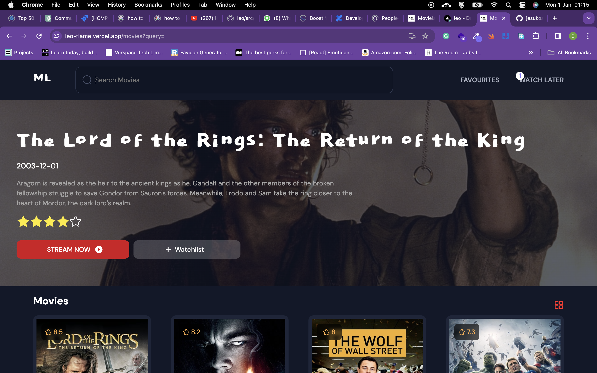

## Movie Listing App

Live Link: [Demo Link](https://leo-flame.vercel.app/)

### Table of Contents

- [About the Project](#about-the-project)
- [Screenshots](#screenshots)
- [Technologies Used](#technologies-used)
- [Setup / Installation](#setup--installation)
- [Approach](#approach)
- [Credits](#credits)

### About the Project

The Movie List App is a React application that showcases a virtualized list of movies using grid system and infinite scrolling. The primary motivation behind the project was to create an application leveraging on core concepts like hooks, modal, grid system e.t.c.

### Screenshots



### Technologies Used

- React
- Redux toolkit
- Jest
- tmdb API

### Setup / Installation

To run the project locally, follow these steps:

1. Clone the repository:

   ```bash
   git clone https://github.com/jesukoseemani/leo
   ```

2. Install dependencies

   npm install

3. Run project

   npm start

### Approach

- The review of the PR was done by commenting under the said code piece that needed consideration and has been pushed to the branched named 'reviews'.

* First of all, walking through the user story and the output given from the PR i decided to refactor for better user experience and interface. Updated the favicon and global font family to be used.

* The project uses scss for styling with the use of **node-sass** package. Unfortunately, a dependency in node-sass is depreciated and could be buggy. so **sass** is more recommended, which is what i switched to for styling. i create utility files that makes scss easy to use like mixins, variables, breakpoints.

* The next is the folder structure which is as follows:

1. assets: This is where the images sits at.
2. components: This is where functional chucks that can be reuseable across the app sits.
3. Hooks: Functional component uses hooks to fire.
4. pages: These are the place where individual pages sits.
5. routes: This is where the routing functionality sits.
6. scss: This is where everything partaining to scss features then each component contains its attached scss file.
7. services: This is where data communication between the app and backend system is managed. the services holds all apis.
8. store: This is where all redux(state management) implementations are managed.
9. test: Contains the test files.
10. utils: This is where all related functions handling common goals are managed and all other dependencies.
11. App: The root start of the app.

- I refactored the routing system and i made use of the new component included in react router 6 which is <Outlet /> and gives the ability to have a shared layout and render other route. This usecase helps because the navbar component is need accross the application.

* I reviewed the task and started with pieces of code that will be useful while working. i realized i will need a modal feature, toast feature, a scroll feature, a skeleton loader, a click outside menu feature, a debounce feature doing search, an api fetch feature.

* i created them with core javascript and react standards with using a third party library

# Modal

This was done by creating two major(modal and modal util) file leveraging on **redux** and **createPortal** from ReactDom.

- first, is the modal components where we render the modal in the portal then pass the props through redux while using the getModalComponent from the modalUtil to determine the modal to render.

- the Modal util was created because it's not a good practice to pass a component directly to redux state.Redux state are meant to only contain serializable values that is ideally plain JavaScript objects, arrays, strings, numbers, booleans, and other primitive values.

- the modal component is rendered at the top level of the app for it to be called anywhere in the app.

# Toast

This is also leverating on **redux** to store and dispatch a change in the properties. A hook was created to show and close a toast, Then a toast component was created and place at the top level of the app which sorts the individual toast and the position. Individual toast component was also created seperately for easy readability. This is where the dynamics in the look and feels comes in, making use of scss to achieve the dynamics.

# Scroll

There are two major scroll effect. The first one is to trigger more movies when it's gets to the last movie in the viewport then the second is to scroll to the top.

-Scroll to top seems to be the common custom hook. I created a useScroll hook that returns the position as stroll, then created a ScrollToTop component where i pass the scroll. i use to the scroll to determine when the scrolltotop icons shows then i use the window.scroll property to make it functional.

-Infinite Scrolling was achieved by creating a hook that leverage on IntersectionObserver majorly with the use of react hooks like useCallBack for memorization and ref to keep track of the last element in the array. The hook takes a callback function and an array of deps as argument. the callback is the api call that request for the next page. then the dependencies are hasNextPage and isNotLoading. this deps needs to be both true before the hook fires.

# Skeleton loader

i created a component with an empty div. majorly achieving it with scss. it requires styling object as props for dynamics incase there will be need for width, height changes .

# Click outside

i created a hook leveraging event listener which will be tracking the event with ref on any click triggered outside.

# Debounce

This is to delay the value of the target element which will reduce to many calls to the server. An hook was created by using the setTimeout fn to set a delay and cleared in the clearup function provided by useEffect hook.

# fetch API

we does neccesarilly need a hook that handles api calls since we use createAsyncThunk and we majorly performing a get method. Fortunately, there will be need for a call to get video/trailer then renders it in the modal. Here comes why an hook was created.

The hook takes in the url, fires the endpoint , push a toast message and returns data, isPending, error.

- I then moved to creating each components that collectively makes a page. movie card, content wrapper, buttons, rating display, navbar, movie banner, empty state.

- Watchlater and favourite looks same. So what was done was to create a single component that just takes in props, which is the data then the handler to differentiate them and a function to clear the data. I persisted the watch later and favourite data in session storage using redux persist for better user experience.

### Issues

React 18.2 has issues with useEffect calling twice and its recomended by the official docs to oot for other third party libraries. Tho i found a kinda working fix but using ref to mount and unmount. if the piece of code is found in my useEffect, this is why.

### Recomendation

- Consider writing the project in typescript for typing which helps with less bugs and better collaboration experience. I used **propType** as an alternative.
- Consider using axios. axios reduces hurdles out of the box
